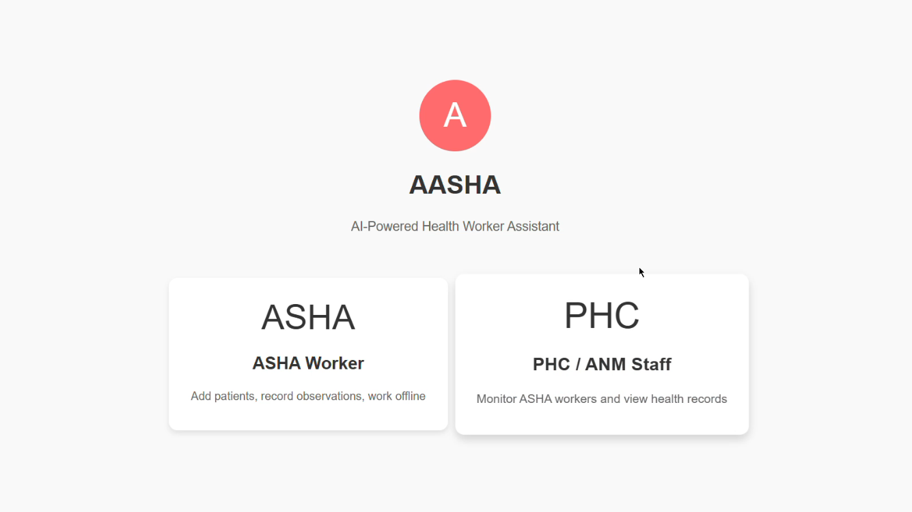
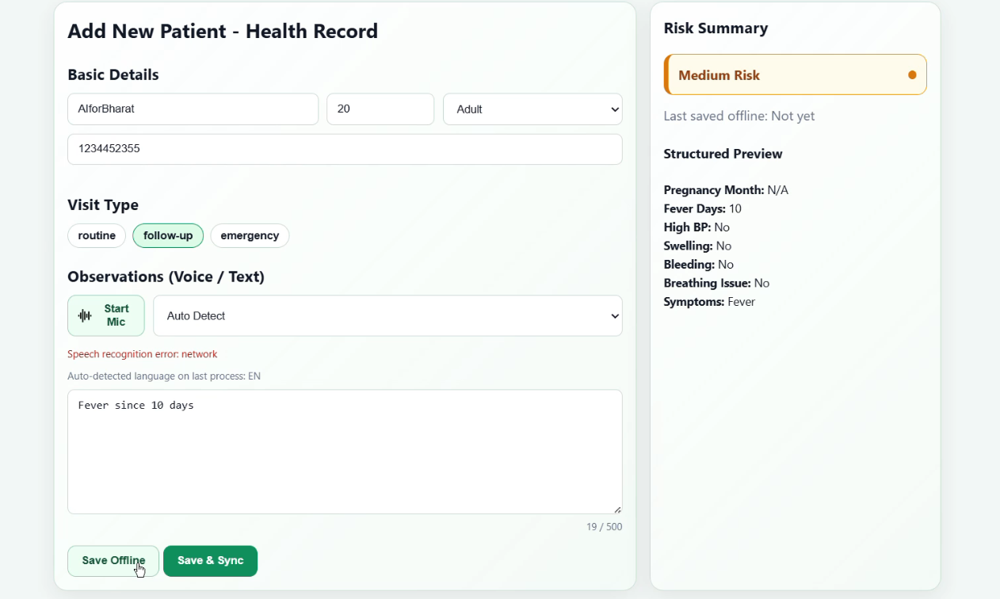
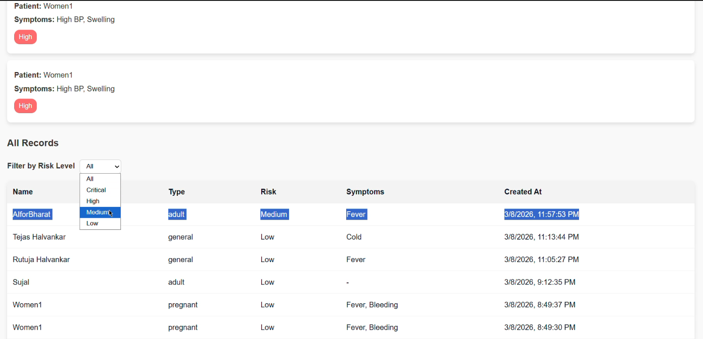

# AASHA — Offline-First Health Data & Risk Flagging System

Offline-first healthcare platform enabling structured patient data capture and real-time risk prioritization in low-connectivity rural environments.

---

## Problem

Rural healthcare workflows suffer from:

- No or low internet connectivity  
- Paper-based record systems  
- Delayed reporting to PHCs  
- No prioritization of high-risk patients  

Result: Critical cases are often identified too late.

---

## Solution

AASHA is an offline-first, AI-assisted system that:

- Converts voice and text into structured health records  
- Flags high-risk cases using explainable rules  
- Stores data locally and syncs automatically  
- Eliminates dependency on continuous internet  

---

## Key Features

- Offline-first data capture using IndexedDB  
- Voice and text input with local language support  
- Rule-based risk engine (explainable, no diagnosis)  
- Automatic sync with retry and conflict handling  
- Role-based dashboards (ASHA, ANM, Doctor)  
- Encrypted local and server-side storage  

---

## System Flow

1. Capture data (voice or text)  
2. Store locally (offline mode)  
3. Structure data using NLP  
4. Apply risk rules  
5. Flag severity (Low to Critical)  
6. Sync when connectivity is available  
7. Dashboard review by PHC  

---

## Screenshots

### Role Selection Interface

Allows users to choose between ASHA worker and PHC dashboards.

---

### Patient Health Record Entry

Offline-first patient data entry using voice or text with automatic structuring and risk evaluation.

---

### Risk Monitoring Dashboard

Dashboard view for PHC staff showing structured records and risk-based filtering.

---

## Architecture

### Frontend (PWA)
- React with TypeScript  
- IndexedDB for offline storage  
- Service Workers for caching and sync  

### Backend
- Spring Boot REST APIs  
- JWT-based authentication  
- Case management and reporting services  

### AI Service
- Python (spaCy, Whisper)  
- Entity extraction  
- Rule-based risk evaluation  

### Database
- PostgreSQL for structured health records and history  

---

## Core Modules

- Offline Data Capture  
- NLP Structuring Engine  
- Risk Assessment Engine  
- Synchronization Manager  
- Role-Based Access Control  
- Reporting Engine  

---

## Security

- AES-256 encryption  
- Secure local storage  
- Encrypted API communication  
- Role-based access control with audit logs  

---

## Performance Targets

- Startup time under 10 seconds  
- Sync completion under 5 minutes  
- Offline support for 30+ days  
- Runs on Android devices with 2GB RAM  

---

## Testing

- Unit and integration testing  
- Offline to sync workflow validation  
- Performance testing on low-resource devices  
- Minimum 80% code coverage (100% for critical modules)  

---

## Tech Stack

- Frontend: React (PWA), TypeScript  
- Backend: Spring Boot, Java 17  
- AI: Python, spaCy, Whisper  
- Database: PostgreSQL  
- Infrastructure: Docker, AWS-ready  

---

## Users

- ASHA Workers  
- ANMs  
- PHC Doctors  
- Administrators  

---

## Project Status

- Architecture completed  
- Core modules defined  
- Ready for implementation  

---

## Authors

- Shreya Awari  
- Sujal Patil  
- Tejas Halvankar  
- Nihal Mishra  

---

## License

MIT
